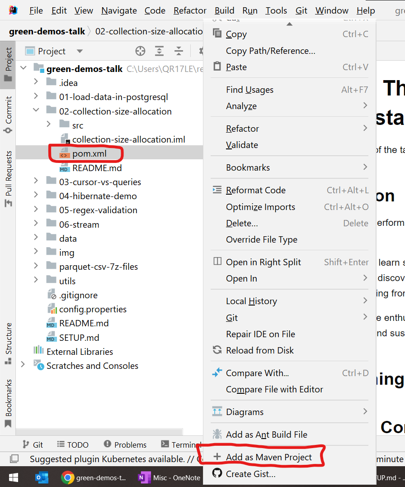
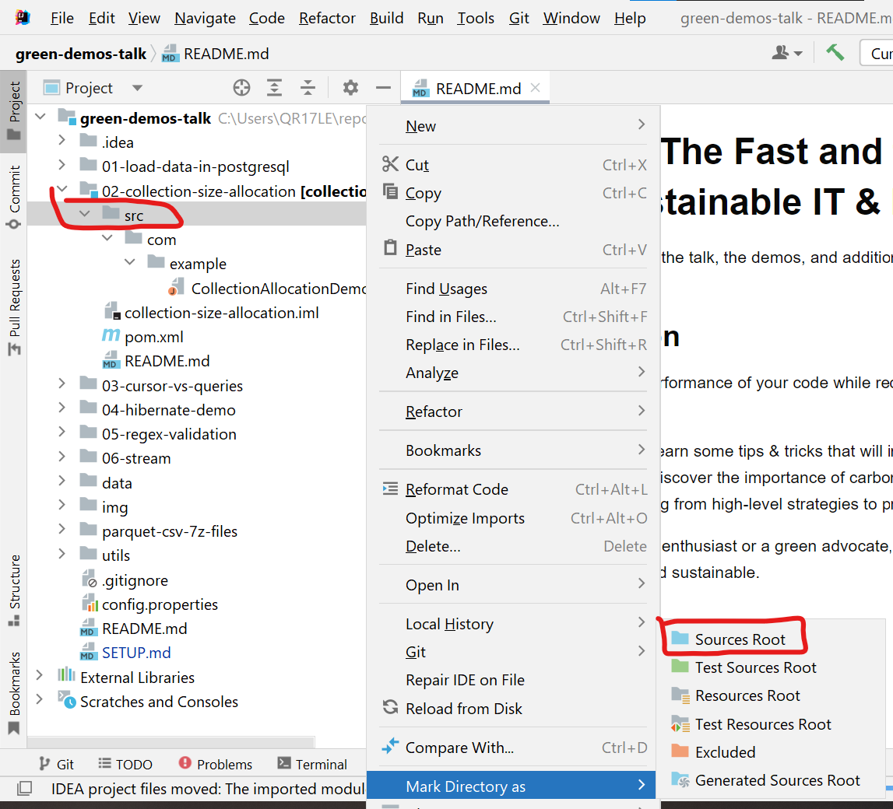
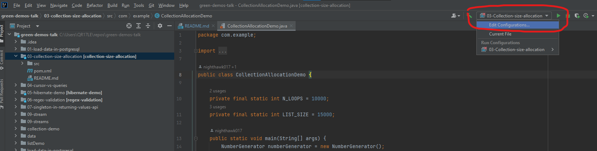
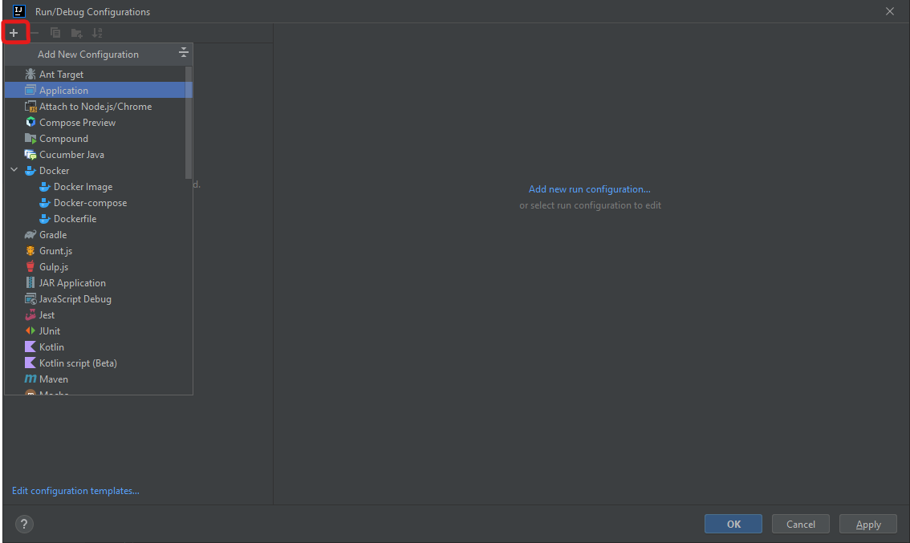
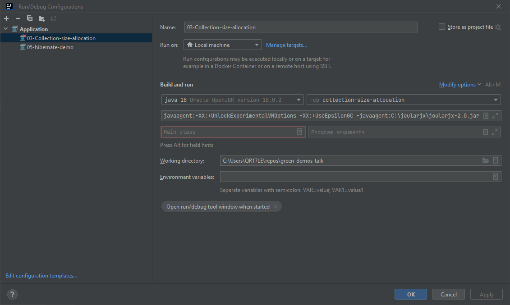
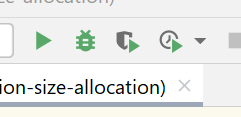

# Setting up the environment
## Stack

The stack used to run the demos is:

* OS: Windows 10
* Java 18
* [Docker](https://docs.docker.com/desktop/install/windows-install/)
* [IntelliJ](https://www.jetbrains.com/idea/)
* [JoularJX](https://github.com/joular/joularjx)
* [Intel Power gadget](https://www.intel.com/content/www/us/en/developer/articles/tool/power-gadget.html)

> To have more consistent results please fix the CPU speed. To do this on Windows, open Regedit
> and set the value of `Attributes` field to 2 for the following registries.
> Registry that sets the Minimum percentage of CPU capabilities
>
>`Computer\HKEY_LOCAL_MACHINE\SYSTEM\CurrentControlSet\Control\Power\PowerSettings\54533251-82be-4824-96c1-47b60b740d00\893dee8e-2bef-41e0-89c6-b55d0929964c`
>
> Registry that sets the Maximum percentage of CPU capabilities
>
>`Computer\HKEY_LOCAL_MACHINE\SYSTEM\CurrentControlSet\Control\Power\PowerSettings\54533251-82be-4824-96c1-47b60b740d00\bc5038f7-23e0-4960-96da-33abaf5935ec
`

## Steps

Once you have everything installed on your PC, follow the steps detailed below to run the demos:

1. Clone the repo.

For java demos, open the root folder of the repo in IntelliJ.

1. In project view right click in "02-collection-size-allocation project > pom.xml" add as Maven Project.

    

2. Right click in the scr folder and "Mark Directory as > Sources Root"

    

3. Edit configurations:

    

4. Add new configuration as application:

    

5. Set the following values:
    * Name (for example): "02-collection-size-allocation"
    * JDK (for example): "Java 18"
    * Module (for example): "collection-size-allocation"
    * Main Class (for example): "com.example.CollectionAllocationDemo"
    * Click on Modify Options > add VM option.
    * Paste the following string in the new added text box. You might need to adapt the path to your local set up: ```-XX:+UnlockExperimentalVMOptions -XX:+UseEpsilonGC -javaagent:C:\joularjx\joularjx-2.0.jar```.
   
    

6. Repeat also these steps for the "utils" project.
7. Repeat these steps for each java project that you might want to run in IntelliJ adapting the values (04-hibernate-demo and 05-regex-validation).

8. Now you can run the projects that you've set up by clicking on the icon of the profiler:


    
For database demos, you'll need to run containers. Just run them following the steps of each readme file ([01-load-data-in-postgresql](./01-load-data-in-postgresql/README.md), [03-cursor-vs-queries](03-cursor-vs-queries/README.md)).
